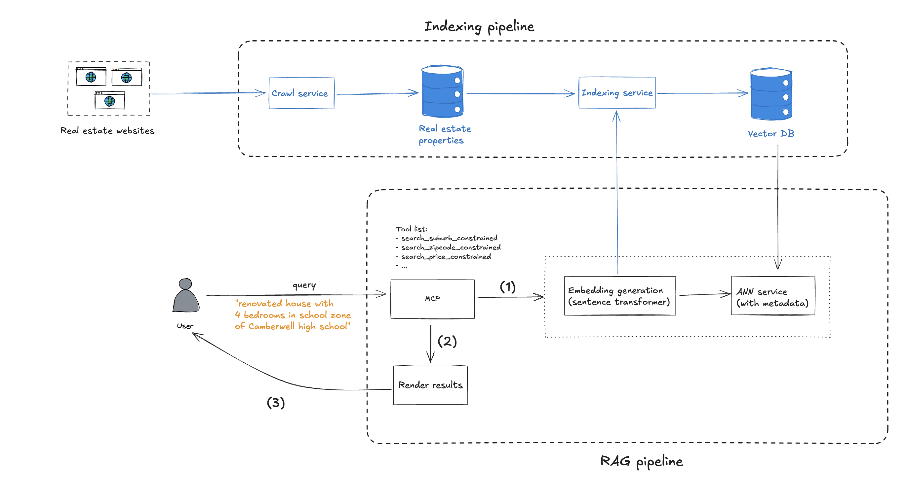

# RealEstate MCP
## What problem is it solving?
Real estate sites in Australia typically offer rigid, suburb-based filters that don’t match how people actually search. For example, a query like “renovated 3-bedroom homes in the Box Hill High School zone” simply isn’t possible.

**This project leverages LLMs and MCP to enable flexible, natural language property search.**

It allows users to search and ask questions about Australian real estate using publicly available property data. The project provides tools and runs a FastAPI server to serve a natural language property search API.

The system includes:
1. An indexing pipeline that downloads property data and populates a vector database for semantic search
2. An MCP server with different search tools
3. A demo client that sends queries and display results


# Examples

```
Enter your query (or type 'quit' to exit): list 3 renovated houses with 4 bedrooms in Camberwell high school zone

Here are some renovated houses with 4 bedrooms located in the Camberwell High School zone:

1. **3/2-4 Georgina Parade, Camberwell VIC 3124**
   - Immaculately renovated throughout, this property boasts sleek modern style in a peaceful and private location. It's close to Hartwell Shopping Centre, Willison Park, and public transport.

2. **2/22 Russell Street, Camberwell VIC 3124**
   - This single-level boutique residence has been stylishly refurbished. Located on a prestigious tree-lined street, it offers sun-drenched dimensions for luxurious living and is near Camberwell Junction.

3. **6 Donna Buang Street, Camberwell VIC 3124**
   - Positioned in a picturesque, tree-lined street, this property presents an opportunity to build a family home or develop further. It's conveniently located for access to local schools.

Each property offers unique features and is ideally situated within the Camberwell High School zone.
```

## 1. Download Data with `run_ingest_pipeline`

This script downloads property details and auction results for a given city and date range.

**Usage:**

```sh
python -m cli.run_ingest_pipeline <city> <start_date> <end_date>
```

- `<city>`: Name of the city (e.g., `melbourne`)
- `<start_date>`: Start date in `YYYY-MM-DD` format (e.g., `2025-02-01`)
- `<end_date>`: End date in `YYYY-MM-DD` format (e.g., `2025-05-10`)

**Example:**

```sh
python -m cli.run_ingest_pipeline melbourne 2025-02-01 2025-05-10
```

This will download property data for Melbourne between February 1, 2025 and May 10, 2025.

---

## 2. Populate the Vector Database with `populate_collection`

This script populates a Chroma vector database collection with property details for semantic search.

**Usage:**

```sh
python -m cli.populate_collection.py <collection_name> <property_details_path>
```

- `<collection_name>`: Name of the ChromaDB collection to populate (e.g., `melbourne`)
- `<property_details_path>`: Path to the property details JSONL file (e.g., `downloaded_data/property_details.jsonl`)

**Example:**

```sh
python -m cli.populate_collection.py melbourne downloaded_data/property_details.jsonl
```

---
## 3. Run the server and the demo client
```bash
python -m cli.server
```

and

```bash
python -m cli.client
```
